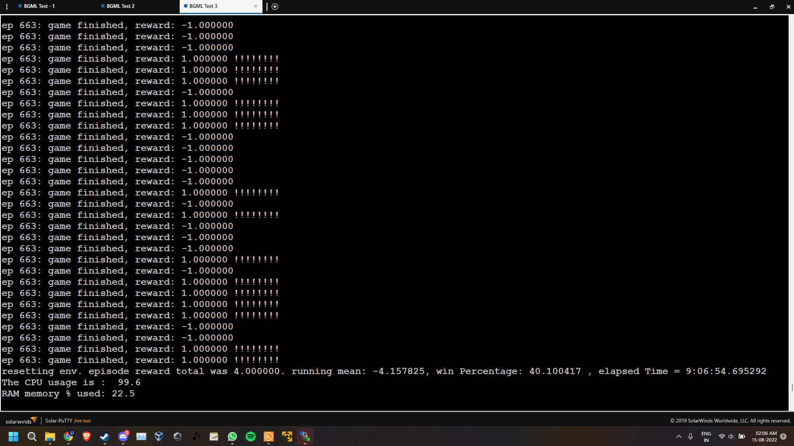

# Test 3

For this test, We took Number of Nuron: 1600

Time taken, Multiple file entries as the program crashed in between due to issue in my system, I uesd the resume feature to resume from the same mean.
| File/Run Name            | Time Elapsed            | Ram Usage|
| -------------------------|:-----------------------:| --------:|
| [Test3Output.txt](./Test3Output.txt)          | 11:16:39.484017         |  18.8%   |
| [Test3Output-Attempt2.txt](./Test3Output-Attempt2.txt) | 2:11:10.473736          |  15.8%   |
| [Test3Output-Attempt3.txt](./Test3Output-Attempt3.txt) | 0:50:35.735957  	       |  16.6%   |
| [Test3Output-Attempt4.txt](./Test3Output-Attempt4.txt) | 2 days, 14:18:11.811602 |  15.1%   |
| [Test3Output-Attempt5.txt](./Test3Output-Attempt5.txt) | 1:19:00.864666          |  20.1%   |
| [Test3Output-Attempt6.txt](./Test3Output-Attempt6.txt) | 0:56:12.877329          |  24.1%   |
| [Test3Output-Attempt6.txt](./Test3Output-Attempt6.txt) | 9:06:54.695292          |  22.5%   |
| __Total Time Taken__ | __3 Day 15:58:41__   | __19%__ (Avg) |

# Test 3 Final Screenshot


# NNPong

This is our Final Project for our Big Data Class in Second Semister in Lambton College. In this project we learn about Nural Network and see how the change in the Number of Nurons and learning rate effects rate of learning. We note the time taken for reaching a Treshold value while the execution of the Program.

This base program is taken from the user [karpathy](https://gist.github.com/karpathy) and the Program - [pg-pong.py](https://gist.github.com/karpathy/a4166c7fe253700972fcbc77e4ea32c5). After that made modifications nescesary for the requirements

## Getting Started

## Environment used
* OS: Ubuntu OS(Linux)
* CPU: 4 Core
* RAM: 7.76 GB


### Dependencies 

* Python3
* Python PIP([PIP List](https://github.com/UsnikB/NNPong/blob/Test1-Test/pip_requirements))

### Installing

* Install the Python Packages needed for the program with following commands
```console
foo@bar:~$ pip install -r pip_requirements
```

### Executing program

* Run the code with the following command
```console
foo@bar:~$ python3 pg-pong.py > Test1Output.txt
```

## Authors

Contributors names and contact info

Usnik Biswas
Linkedin: [usnik-biswas](https://www.linkedin.com/in/usnik-biswas/)

## Version History

Link to All Branches
* [Main](https://github.com/UsnikB/NNPong/tree/main)


## Acknowledgments

Inspiration, code snippets, etc.
* [karpathy](https://gist.github.com/karpathy)
* [awesome-readme](https://github.com/matiassingers/awesome-readme)
